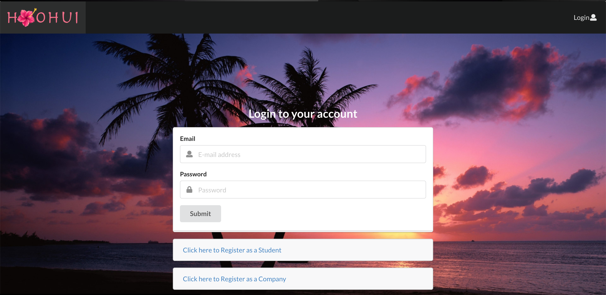
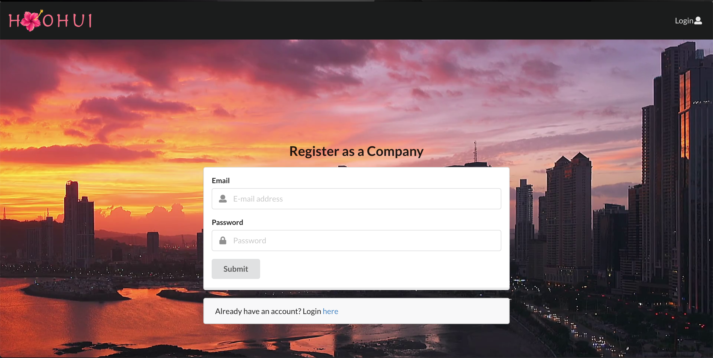
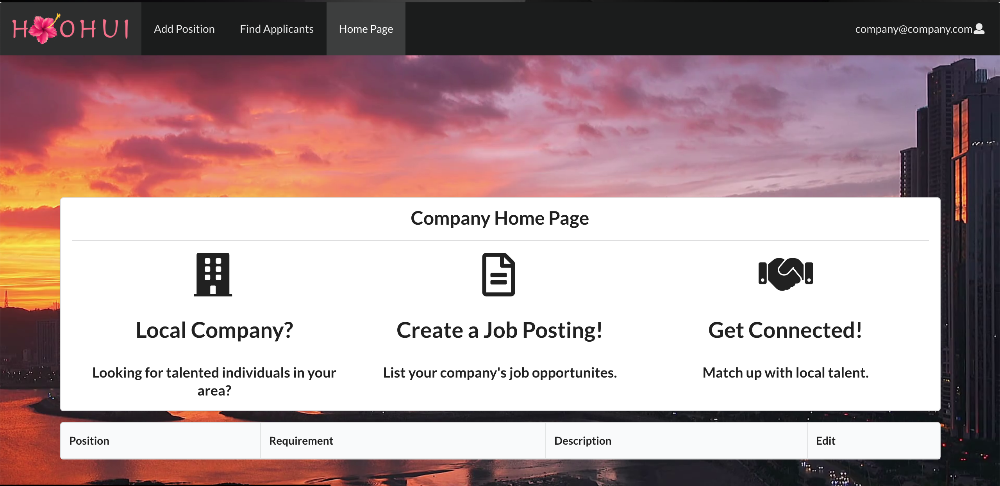
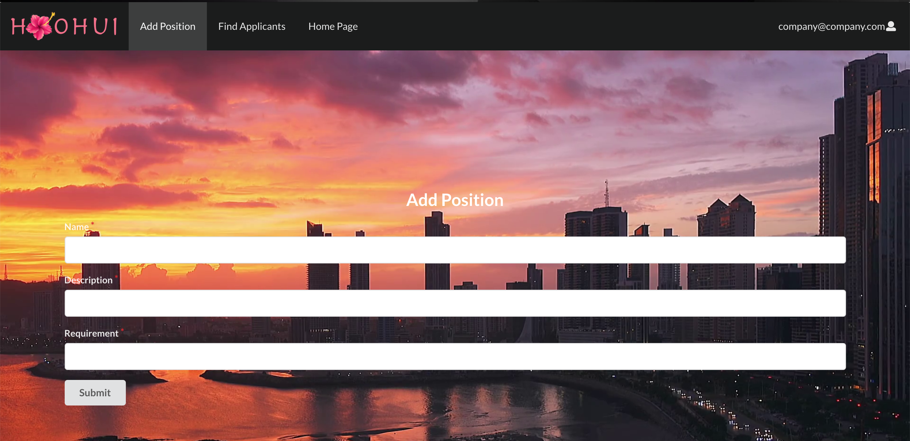
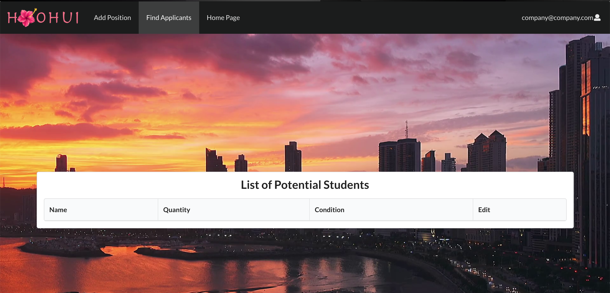
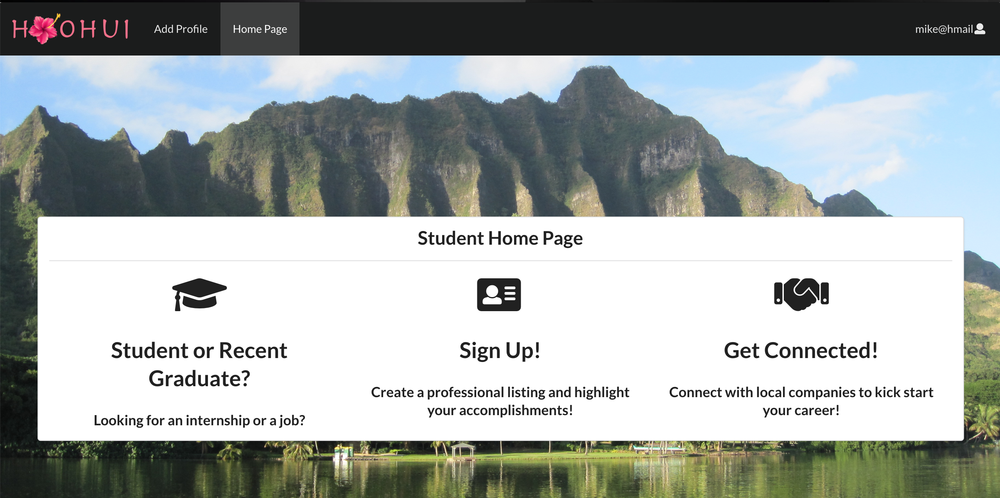
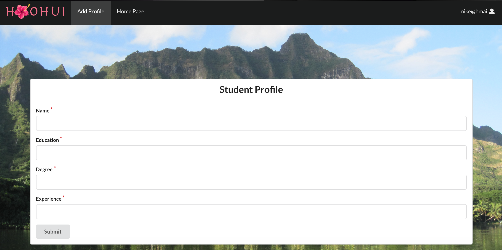

# View our website

* [Ho'ohui](https://hoohui.meteorapp.com/)

# Table of contents

* [About Us](#about-us)
* [Development History](#development-history)

# About Ho'ohui
Our goal is to create a better way to connect students to job opportunities. This can be from internships to potential job openings, we are striving to inform graduating students about various companies that are hiring within the year in order to give these students a chance at starting their career after college. We also want to include the hiring companies to interact with the students by hvaing them make their own account and choose from the listed users.

# Development History
## Progress
* [Deployed Version](https://hoohui.meteorapp.com/)
* [Milestone 1](https://github.com/ho-ohui/hoohui/projects/1)
* [Milestone 2](https://github.com/ho-ohui/hoohui/projects/2)
* [Milestone 3](https://github.com/ho-ohui/hoohui/projects/3)

## Features of the system
<ul>
  <li>Users can register or login as student or company.</li>
  <li>Collections and schemas of student and company.</li>
  <li>Admin has permission to edit all data and create new categories.</li>
  <li>The system will match students to companies based on their skills and preference, and vice-versa</li>
</ul>

## Guide
  <dir>
  <h4>Landing</h4>
  
When you first enter the webpage you are greeted with this home page, from here you are able to login to your account(if you have one) or register for an account.

  
  </dir>
  
  <dir>
  <h4>Sign Up</h4>
  
Register as a Student

  
  
Register as a Company

  
  </dir>
  
  <dir>
  <h4>Company Home page</h4>
  
  </dir>
  
  <dir>
  <h4>Company Add Position</h4>
  
  </dir>
  
  <dir>
  <h4>Applicants Page</h4>
  
  </dir>
  
  <dir>
  <h4>Student Home page</h4>
  
  </dir>
  
  <dir>
  <h4>Student Profile Page</h4>
  
  </dir>
  
## Installation

Step 1: Install [Meteor](https://www.meteor.com/install).

Step 2: [Download a copy of Ho'ohui](https://github.com/ho-ohui/hoohui).

Step 3: cd into the app directory install the required libraries with:

<code> $ meteor npm install </code>

Once the libraries are installed, you can run the application by invoking:

<code> $ meteor npm run start </code>

## Application Design
### Data model
The ho'ohui data mode is implemented by two javascript classes: StudentProfile and Position. Both of them encapsulate a MongoDB collection with the same name and export a single variable that provides access to that collection.

## About Us

### Dylan Ubongen
I am currently a Junior at the University of Hawaii at Manoa. My major is Computer Science with a focus in the security track. Some of my previously aquired skills are the various programing laguages that I've learned, such as, C, C++, Java, Javascript, etc. However, one of my goals is to improve my web development skills.

### Trevin Tejero
I'm currently a Junior at the University of Hawaii at Manoa. My major is Computer Science with a focus in the security track. I would like to improve upon my web development and project management skills.

### Kaili Kameoka
I am majoring in Computer Science at the University of Hawaii. My interests are in building websites and other web applications.

### Dawei Yang
My major is Computer Engineering, and I will graduate this December. I focus on hardward design and IoT, and I want to imporve the skill of project management.
