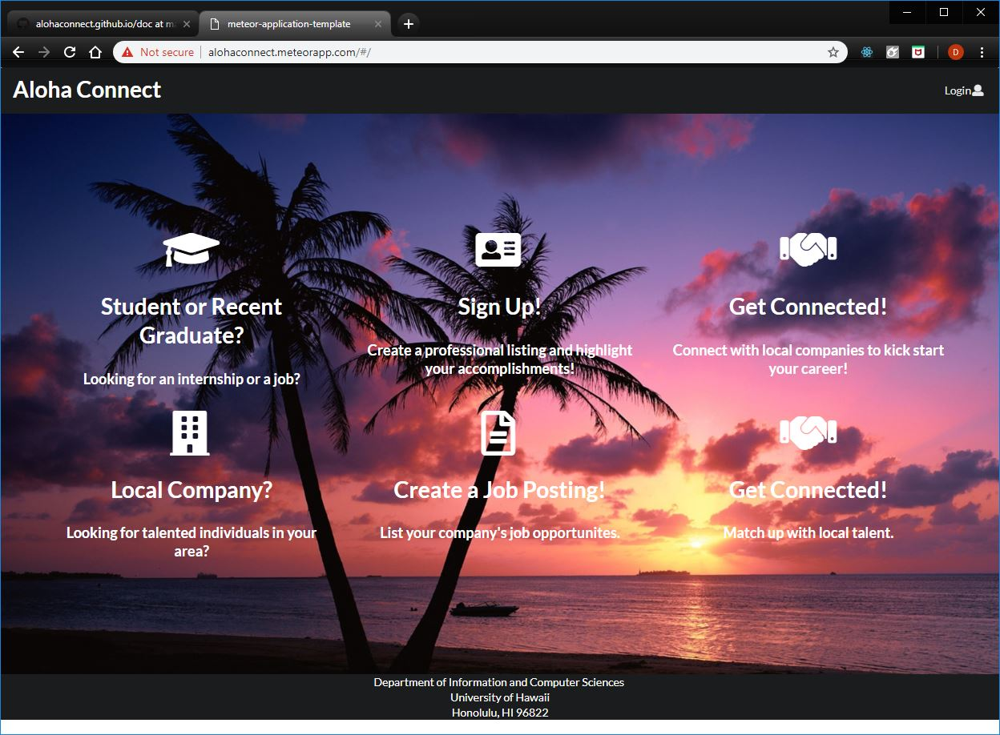
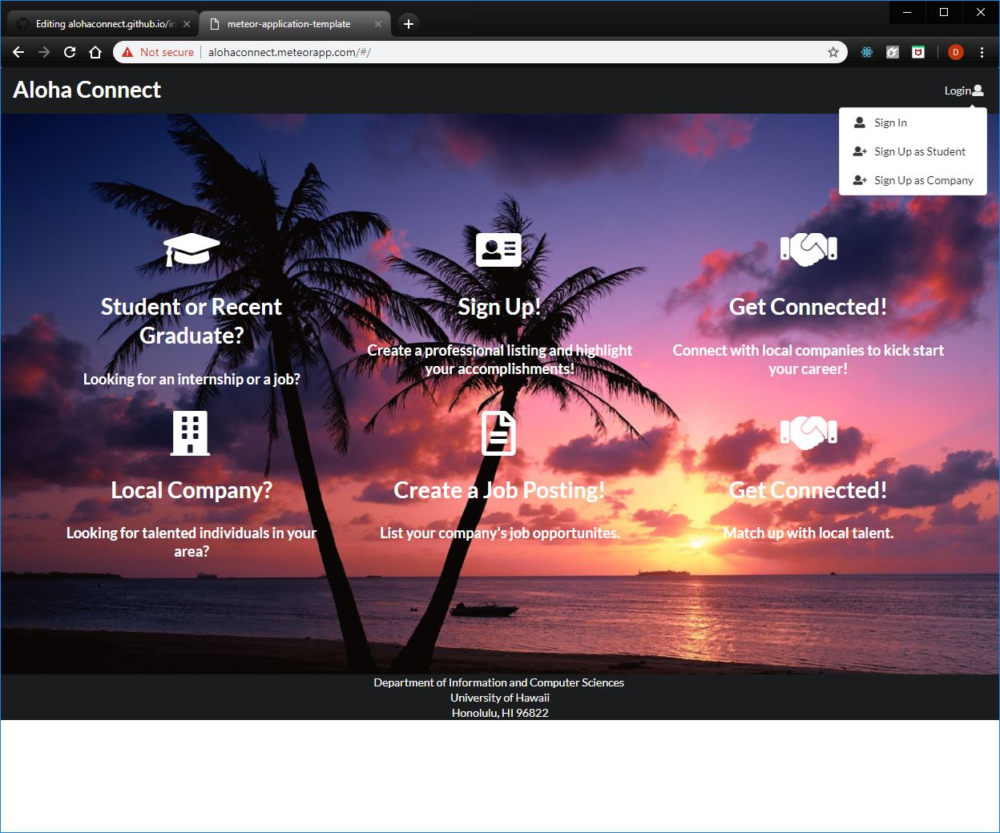
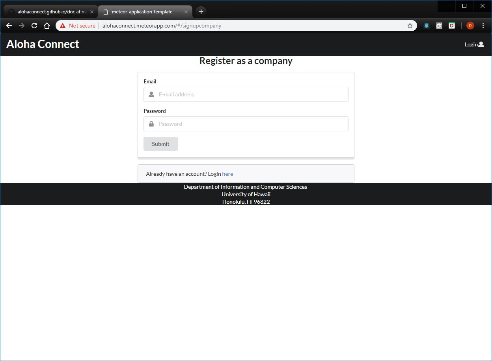
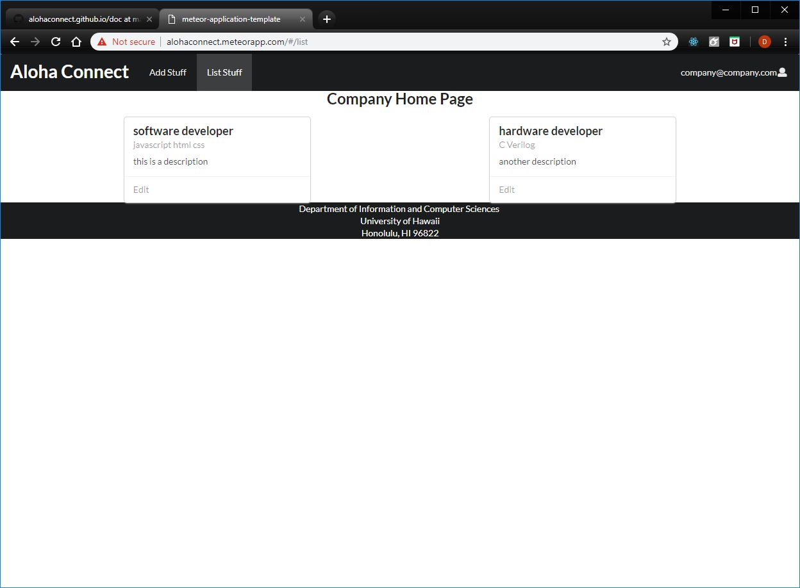
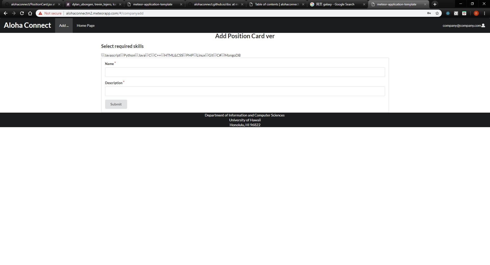

# Table of contents

* [About Us](#about-us)
* [Developement History](#developement-history)

# About Us
Our goal is to create a better way to connect students to job opportunities. This can be from internships to potential job openings, we are striving to inform graduating students about various companies that are hiring within the year in order to give these students a chance at starting their career after college. 

# Features of the system
<ul>
  <li>Users can register or login as student or company.</li>
  <li>Collections and schemas of student and company.</li>
  <li>Admin has permission to edit all data and create new categories.</li>
  <li>The system will match students to companies based on their skills and preference, and vice-versa</li>
</ul>

# Mockup Pages

  <dir>
  <h4>Landing</h4>
  
  </dir>
  <dir>
  <h4>Sign Up</h4>
  
User can sign up as a student or a company. 

  
  </dir>
  <dir>
  <h4>Register as a company</h4>
  
  </dir>
  <dir>
  <h4>Company home page</h4>
  
  </dir>
  <dir>
  <h4>Company add position</h4>
  
  </dir>
  <dir>
  
Since Sign in is not implemented, our app cannot show the student home page now. It is similar to the company home page 
 
  </dir>

# Developement History
Milestone 1
