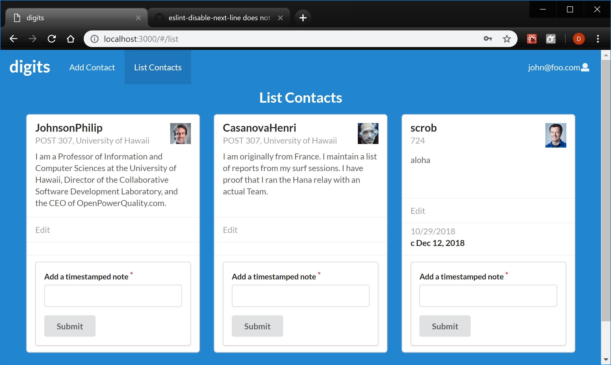

# Table of contents

* [About Us](#about-us)
* [Developement History](#developement-history)

# About Us
Our goal is to create a better way to connect students to job opportunities. This can be from internships to potential job openings, we are striving to inform graduating students about various companies that are hiring within the year in order to give these students a chance at starting their career after college. 

# Features of the system
<ul>
  <li>Users can register or login as admin, student or company.</li>
  <li>One data set stores companies's information; one data set stores students' information.</li>
  <li>Admin has permission to edit all data and create new categories.</li>
  <li>The system will match students to companies based on their skills and preference, and vice-versa</li>
</ul>

# Mockup Pages

  <dir>
  <h4>Landing<h4>
  
  
  <h4>Student home page and company home page</h4>
  

  <h4>Admin home page</h4>
  

  <h4>Student profile page and company profile page</h4>
  
  </dir>

# Developement History
Milestone 1
